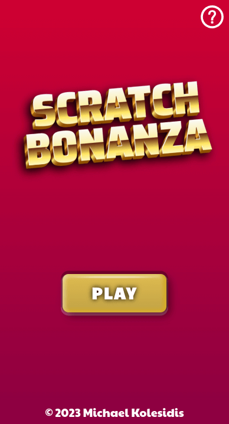
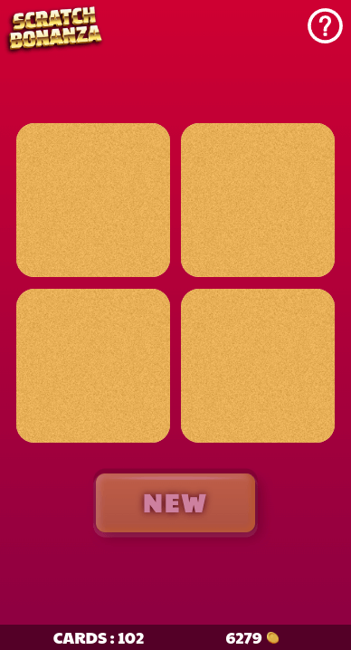
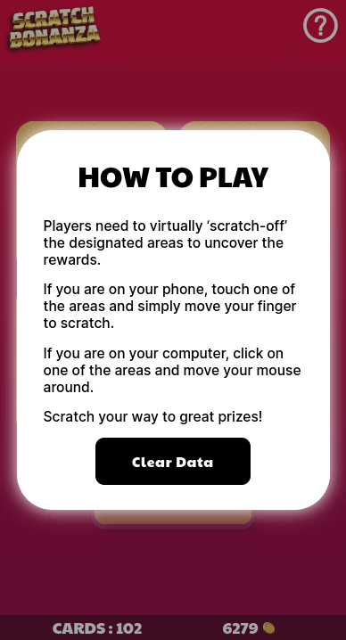

**An online scratchcard game. Do you feel lucky?**

<a href='https://ko-fi.com/michaelkolesidis' target='_blank'></a>

There are five different rewards with different sounds, 1🪙, 10🪙, 100🪙, 1000🪙 or 0🍌. It is a full-stack implementation, with the rewards generated on the server.

## Instructions

In order to run the project locally you need to start both the client (this repository) and the server, that can be found in its own repository, [Scratch Bonanza Server](https://github.com/michaelkolesidis/scratch-bonanza-server).

**1.** Start the server.

**2.** Install the project dependencies:

```
yarn
```

**3.** Start Vite:

```
yarn dev
```

### Demo

There is also an online deployment of _Scratch Bonanza_ that can be found in [here](https://scratch-bonanza.vercel.app/). The online version is deployed in [Vercel](https://vercel.com/) and is configured to use an online deployment of the server, deployed in [Render](https://render.com/).

When using the online version, you should note that loading the first scratchcard will usually take around 30-50 seconds, as the project is hosted using the free tier of Render, thus the server sleeps when inactive. On rare occasions, the server might take up to 5 minutes to respond to the first call.

## Features

### Architecture

- Three game phases: ready, playing, ended
- Total number of coins won saved both in state and in local storage
- Number of scratchcards used saved both in state and in local storage
- Clear data functionality

### Gameplay

- Each scratchcard features four scratchable areas that have a reward hidden underneath
- Five different reward options: **1**🪙, **10**🪙, **100**🪙, **1000**🪙 or **0**🍌

### UI/UX

- New game and restart functionality
- Stats bar at the bottom displaying total coins won and total scratchcards used
- New button is active only when all four areas have been scratched
- Help modal available in all screens
- Responsive for mobile (iPhone 13 Pro and iPhone SE) and desktop
- Animated logo

### Sound

- Scratching sound while scratching implemented both on touch and on non-touch devices
- Four different sounds when revealing an award (a sound for 0 bananas, a sound for 1 coin, another sound for 10 coins, and another sound for 100 and 1000 coins)
- Sound when a new card loads

## Screenshots









## Technologies

The core technologies of _Scratch Bonanza_ are JavaScript, CSS and the Canvas API. The following libraries and tools are used:

| Name                            | License | Description                                         |
| ------------------------------- | :-----: | --------------------------------------------------- |
| TypeScript                      |   MIT   | A strongly typed language that builds on JavaScript |
| React                           |   MIT   | Component-based, front-end interface library        |
| React Router                    |   MIT   | Declarative routing for React web applications      |
| React Scratchcard               |   MIT   | A scratchcard component for React                   |
| Zustand                         |   MIT   | State management                                    |
| Vite                            |   MIT   | Frontend development tooling                        |
| Vitest (Planned)                |   MIT   | Unit test framework powered by Vite                 |
| React Testing Library (Planned) |   MIT   | Testing utility                                     |

## Roadmap

- Testing
- Different game modes with different sets of awards
- Credits
- Translations

## Software Used

A non-exhaustive list of all the software that was used during the development of _Scratch Bonanza_.

- Visual Studio Code
- Inkscape
- Audacity
- Google Chrome
- Microsoft Edge
- Mozilla Firefox

## 💖 Support the Project

Thank you so much for your interest in my project! If you want to go a step further and support my open source work, buy me a coffee:

<a href='https://ko-fi.com/michaelkolesidis' target='_blank'></a>

## See Also

- [Scratch Bonanza Server](https://github.com/michaelkolesidis/scratch-bonanza-server)

## License

<a href="https://www.gnu.org/licenses/agpl-3.0.html"></a>

Copyright (c) 2023 Michael Kolesidis<br>
Licensed under the [GNU Affero General Public License v3.0](https://www.gnu.org/licenses/agpl-3.0.html).
