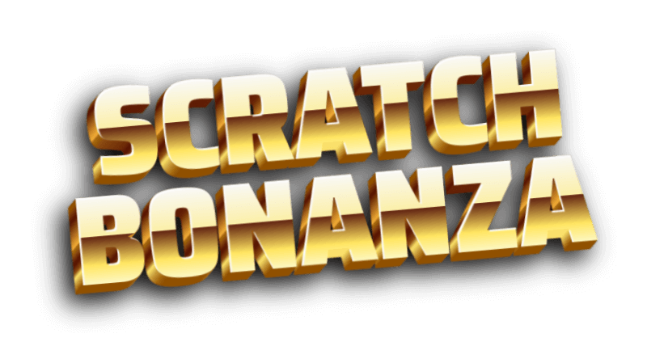

An online scratchcard game. Do you feel lucky?

## Instructions

In order to run the project locally you need to start both the client (this repository) and the server, that can be found in its own repository, [Scratch Bonanza Server](https://github.com/michaelkolesidis/scratch-bonanza-server)

Install the project dependencies:

```
yarn
```

Start Vite:

```
yarn dev
```

### Demo

There is also an online deployment of _Scratch Bonanza_ that can be found in [here](https://scratch-bonanza.vercel.app/). The online version is deployed in [Vercel](https://vercel.com/) and is configured to use an online deployment of the server, deployed in [Render](https://render.com/).

When using the online version, you should note that loading the first scratchcard will usually take around 15-20 seconds, as the project is hosted using the free tier of Render, thus the server sleeps when inactive.

## Features

- Each scratchcard features four scratchable areas that have a reward hidden underneath
- Five different reward options: **1**🪙, **10**🪙, **100**🪙, **1000**🪙 or **0**🍌
- Scratching sound while scratching implemented both on touch and on non-touch devices
- Help modal available in all screens

## Technologies

The core technologies of _Scratch Bonanza_ are JavaScript, CSS and the Canvas API. The following libraries and tools are used:

| Name                  | License | Description                                         |
| --------------------- | :-----: | --------------------------------------------------- |
| TypeScript            |   MIT   | A strongly typed language that builds on JavaScript |
| React                 |   MIT   | Component-based, front-end interface library        |
| React Router          |   MIT   | Declarative routing for React web applications      |
| React Scratchcard     |   MIT   | A scratchcard component for React                   |
| Zustand               |   MIT   | State management                                    |
| Vite                  |   MIT   | Frontend development tooling                        |
| Jest                  |   MIT   | JavaScript testing framework                        |
| React Testing Library |   MIT   | Testing utilitie                                    |

## Screenshots

## Gameplay and Rules

## Software Used

A non-exhaustive list of all the software that was used during the development of _Scratch Bonanza_.

- Visual Studio Code
- Inkscape
- Audacity
- Google Chrome
- Microsoft Edge
- Mozilla Firefox

## Assets

## See Also

- [Scratch Bonanza Server](https://github.com/michaelkolesidis/scratch-bonanza-server)

## License

Copyright (c) 2023 Michael Kolesidis - All Rights Reserved.

THE CONTENTS OF THIS PROJECT ARE PROPRIETARY AND CONFIDENTIAL.
UNAUTHORIZED COPYING, TRANSFERRING OR REPRODUCTION OF THE CONTENTS OF THIS PROJECT, VIA ANY MEDIUM IS STRICTLY PROHIBITED.
